# Dynamo on AMD ROCm — System Design

> NVIDIA Dynamo adapted for AMD Instinct MI355X. All changes are additive (🆕 new / 🔧 patched) — the upstream codebase is untouched.

---

## 1. System Architecture

The system follows Dynamo's standard Frontend → Router → Workers architecture, with AMD-specific additions highlighted.

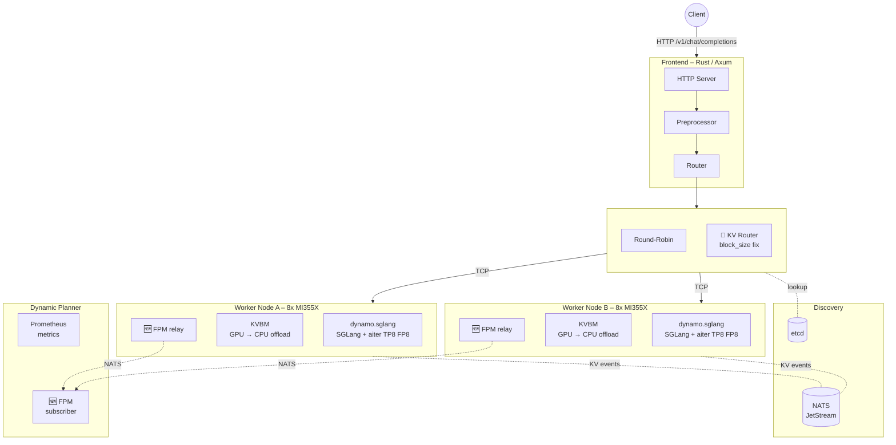

---

## 2. AMD Additive Changes

Every change lives on the `amd-dynamo` branch. Nothing is removed from upstream.

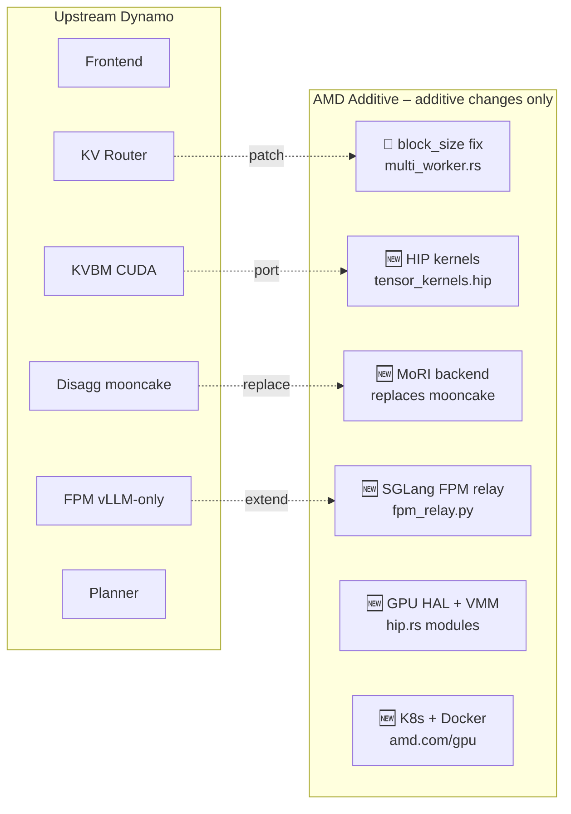

| Layer | What Changed | Type |
|:------|:-------------|:----:|
| KV Router | `multi_worker.rs` — graceful default when `block_size ≤ 1` | 🔧 |
| KVBM Kernels | `tensor_kernels.hip` + HIP build path | 🆕 |
| Disagg Transfer | `--disaggregation-transfer-backend mori` (replaces mooncake) | 🆕 |
| RIXL DRAM Staging | `nixl_rocm_staging.py` — monkey-patch NixlKVManager for DRAM bounce | 🆕 |
| Mooncake ROCm Patch | `mooncake_rocm_rdma.patch` — GPU/CPU MR detection + ionic max_sge | 🆕 |
| Planner FPM | `fpm_relay.py` — SGLang KvMetrics → ForwardPassMetrics | 🆕 |
| GPU Memory | HIP VMM facade, `hip.rs` HAL modules (6 files) | 🆕 |
| Containers | ROCm Dockerfile blocks, `context.yaml` | 🆕 |
| K8s / Helm | AMD GPU discovery, `amd.com/gpu` resource | 🆕 |
| Python | Lazy imports for `nixl`, `OmniConfig`, `typing.Self` | 🔧 |
| CI | ROCm build workflow, pre-commit hook | 🆕 |

---

## 3. Disaggregated Serving with MoRI RDMA

Prefill and decode run on separate nodes. KV cache is transferred over RDMA via AMD's MoRI library through Pensando Pollara 400 ionic NICs.

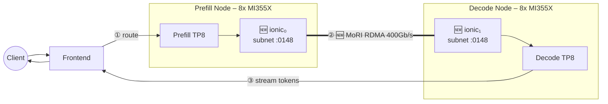

### Transfer Backend Matrix

| Backend | Status | Performance | Issue |
|:--------|:------:|:------------|:------|
| **🆕 MoRI RDMA** | ✅ | **106.6 req/s** (Qwen) · **7.4 req/s** (DSV3) | — |
| **🆕 RIXL + DRAM Staging** | ✅ | RDMA via pinned host bounce | Monkey-patch, zero SGLang changes |
| **🆕 Mooncake + ROCm patch** | ✅ | — | `bash scripts/patch_mooncake_rocm.sh` to enable |
| Mooncake RDMA (unpatched) | ❌ | — | `ibv_reg_mr ENOMEM` — no GDR on ionic |
| Mooncake TCP | ⚠️ | 76.2 req/s (Qwen only) | DSV3 crashes |
| RIXL / nixl (unpatched) | ❌ | — | VRAM registration fails |

### Ionic Subnet Matching

> **Critical**: ionic device numbers are **not** consistent across nodes. Always verify subnets via GID tables.

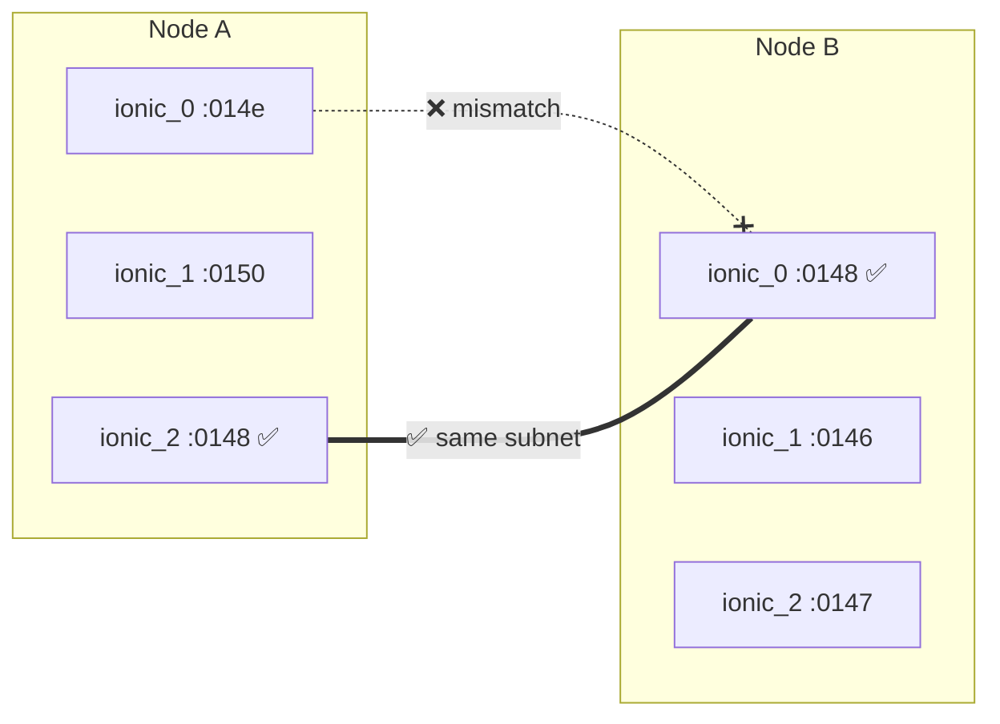

Find matching pairs:

```bash
# On each node — check subnet of every ionic device
for i in 0 1 2 3 4 5 6 7; do
  gid=$(cat /sys/class/infiniband/ionic_$i/ports/1/gids/1)
  echo "ionic_$i  $(echo $gid | cut -d: -f1-4)"
done
```

---

## 3b. RIXL DRAM Staging (Plan B)

When using RIXL/nixl instead of MoRI, GPU VRAM cannot be registered with ionic NICs. The `nixl_rocm_staging.py` monkey-patch solves this at runtime without modifying SGLang source.

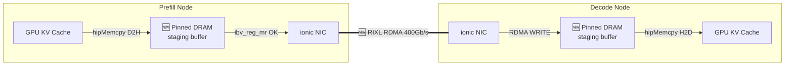

**Key design**: wrap `agent.get_xfer_descs` once at init → all 3 transfer methods (`_send_kvcache_generic`, `send_kvcache_slice`, `_send_mamba_state`) are automatically patched. SGLang `conn.py` stays pristine.

Enable: `export SGLANG_NIXL_ROCM_STAGING=1` or auto-detected on ROCm.

## 3c. Mooncake ROCm Patch (Plan A)

The C++ patch (`patches/mooncake_rocm_rdma.patch`) modifies `registerMemoryRegionInternal()`:

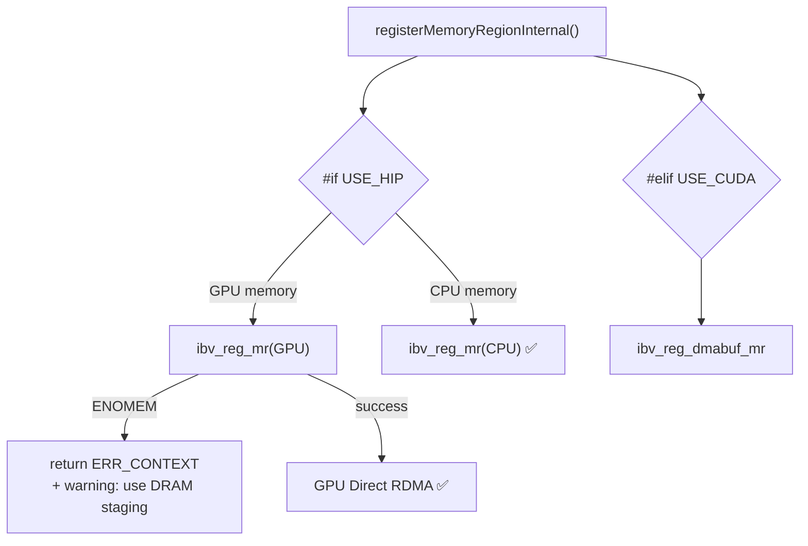

Also patches `config.cpp`: auto-detects Pensando ionic (`vendor_id=0x1dd8`) → `max_sge=2`.

---

## 4. Component Stack

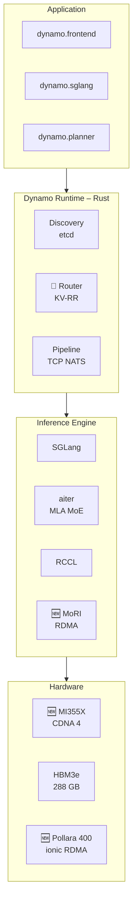

---

## 5. SGLang FPM Relay

Upstream Dynamo only supports Forward Pass Metrics (FPM) for vLLM. The 🆕 `SglangFpmRelay` bridges SGLang scheduler metrics to the same event plane, enabling the Dynamic Planner to auto-scale SGLang workers.

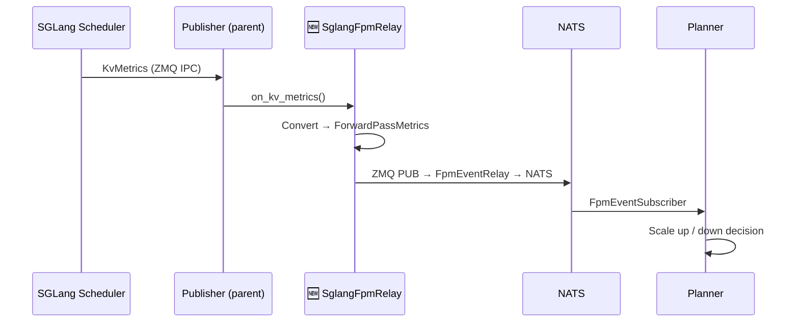

Enable: `export DYN_FORWARDPASS_METRIC_PORT=20380`

---

## 6. Bug Fixes & Performance Impact

| # | Bug | Layer | Fix | Before → After |
|:-:|:----|:------|:----|:---------------|
| 1 | CUDA graph conflict | aiter MLA kernel | `SGLANG_AITER_MLA_PERSIST=False` | 7,544 → **687 ms** TTFT  (**11×**) |
| 2 | KV Router panic | Rust runtime | Default `block_size` to 16 | Crash → **4.35× TTFT** at c=32 |
| 3 | Mooncake on AMD | Transfer backend | Switch to MoRI | Blocked → **7.4 req/s** DSV3 |
| 4 | Ionic ABI mismatch | Container driver | Mount host `libionic1` | No RDMA → **106.6 req/s** |
| 5 | `typing.Self` | Python 3.10 | Conditional import | Import crash → OK |
| 6 | `OmniConfig` | Python import | Lazy import | Startup crash → OK |

---

## 7. Kubernetes Deployment

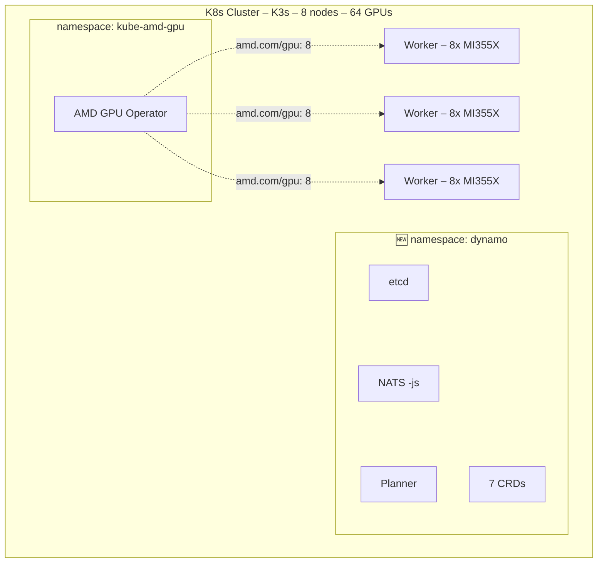

---

## 8. Request Lifecycle

### Aggregated Mode

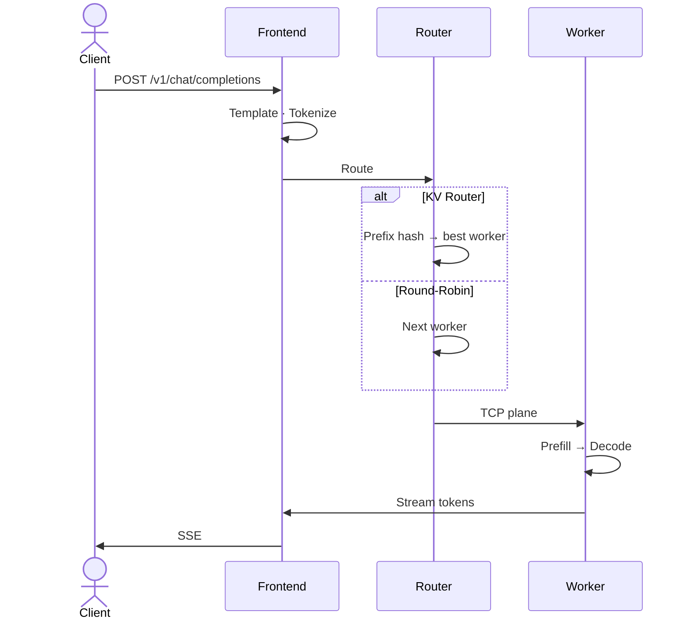

### Disaggregated Mode

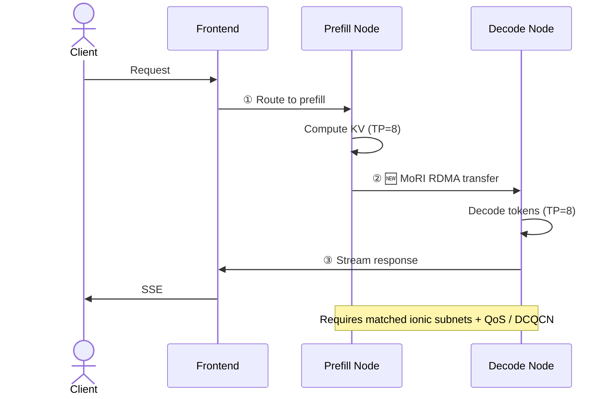
