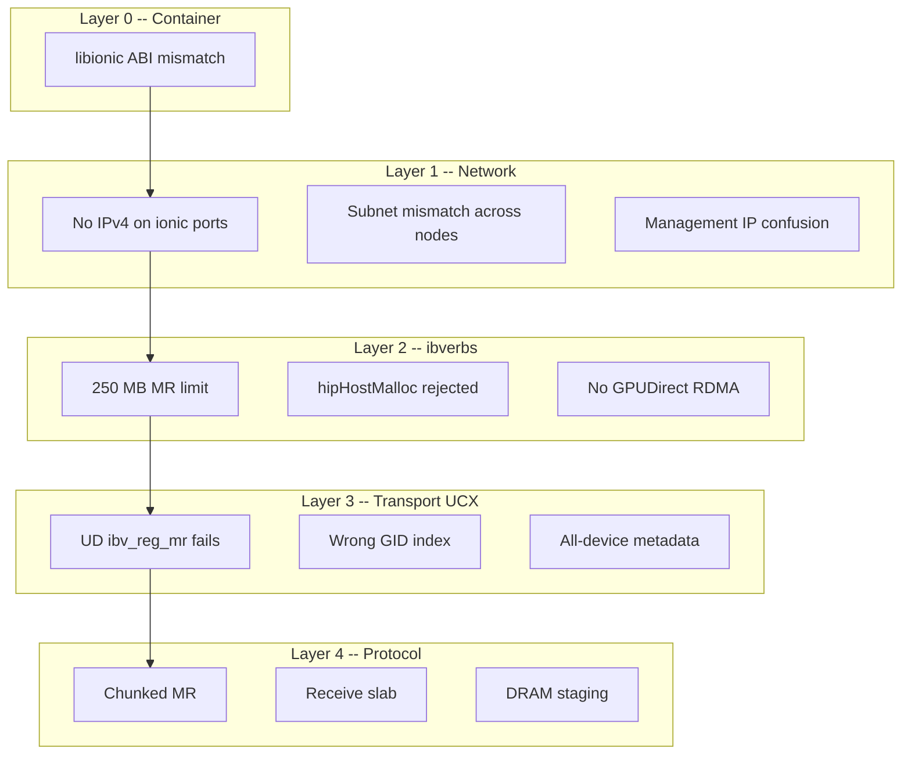
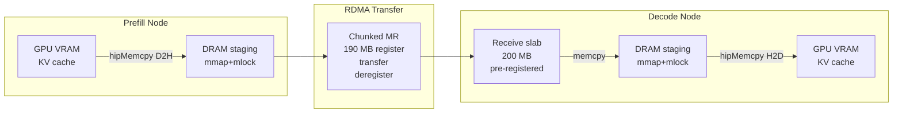
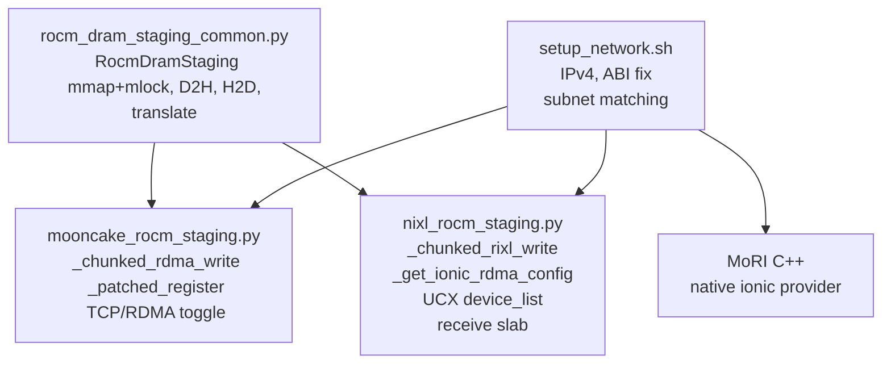

# Ionic RDMA on MI355X: Experience Summary and Cross-Backend Fix Guide

> Comprehensive catalog of every Pensando ionic RDMA issue encountered on
> AMD Instinct MI355X and the fixes applied across MoRI, Mooncake, and
> RIXL/nixl disaggregated serving backends.

## Problem Landscape

Pensando ionic (Pollara 400) NICs on MI355X differ from Mellanox/NVIDIA
ConnectX in five areas that break standard RDMA workflows. Fixes are
organized by the layer they affect, from container setup through
application protocol.



---

## Fix Catalog

### Layer 0 -- Container: libionic ABI Mismatch

**Problem.** The Docker image ships `libionic.so.1.0.54.0-149` but the host
kernel module expects `1.1.54.0-185`. Result: `ibv_devinfo` shows 0 ionic
devices, MoRI asserts `availDevices.size() > 0`.

**Why bind-mount fails.** Docker `-v host.so:/container/libionic.so.1:ro`
follows the container's symlink and mounts at the *target* path
(`libionic.so.1.0.54.0-149`), leaving the symlink unchanged. The old
library is still loaded.

**Fix.** Use `docker cp` after container creation:

```bash
HOST_LIB=$(ls /usr/lib/x86_64-linux-gnu/libionic.so.1.1.* | head -1)
docker cp "$HOST_LIB" CONTAINER:/usr/lib/x86_64-linux-gnu/libionic.so.1
# Verify: must show 8
docker exec CONTAINER ibv_devinfo 2>&1 | grep hca_id | wc -l
```

Or use the helper: `bash setup_network.sh --fix-abi CONTAINER`

**Applies to:** All backends (MoRI, Mooncake, RIXL). Any process calling
ibverbs on ionic inside a container hits this.

**Files:**
- `scripts/benchmark/setup_network.sh` -- `fix_abi()` function
- `scripts/run_infx_benchmarks.sh` -- `fix_libionic()` after `start_container()`
- `InferenceX/.../amd_utils/env.sh` -- auto-fix from `/host_libs`
- `InferenceX/.../amd_utils/job.slurm` -- `-v /usr/lib/x86_64-linux-gnu:/host_libs:ro`

---

### Layer 1a -- Network: IPv4 on Ionic Ports

**Problem.** ionic ports ship with no IPv4 address. Without IPv4, the RDMA
GID table lacks IPv4-mapped entries (`::ffff:a.b.c.d`). RoCE v2 QP
transitions (INIT to RTR) call `ibv_modify_qp` which requires a valid GID.
Result: `EINVAL` and silent process death.

**Fix.** Assign IPv4 addresses based on GID fabric subnet prefixes:

```bash
bash scripts/benchmark/setup_network.sh          # auto-detect node ID
bash scripts/benchmark/setup_network.sh --verify  # check
```

The script reads each device's GID[1] (ULA prefix) to derive a unique
subnet number, then assigns `192.168.{subnet}.{node_id}/24`.

**Applies to:** All RDMA backends.

**Files:**
- `scripts/setup_ionic_network.sh` -- full version with `--in-container`
- `scripts/benchmark/setup_network.sh` -- lightweight version
- `InferenceX/.../amd_utils/env.sh` -- inline loop for CI

---

### Layer 1b -- Network: Subnet Mismatch Across Nodes

**Problem.** ionic device indices (`ionic_0` through `ionic_7`) do NOT map
to the same physical port on every node. On chi2899 `ionic_0` is
`enp233s0` (subnet 192.168.1/26), but on chi2900 `ionic_0` is `enp9s0`
(subnet 192.168.1/20). If a backend pairs devices by index, QPs on
mismatched subnets time out.

**Diagnosis:**

```bash
bash setup_network.sh --match <REMOTE_HOST>
```

**Fix.** MoRI handles this internally (auto-matches subnets across all
specified devices). Mooncake and RIXL require explicit
`--disaggregation-ib-device` or rely on the monkey-patch to filter.

**Applies to:** All backends, but MoRI is self-healing while Mooncake/RIXL
need explicit device lists.

---

### Layer 1c -- Network: Management IP Confusion

**Problem.** After adding IPv4 to ionic ports, `hostname -I` may return an
ionic address first. Using this for etcd/nats/bootstrap breaks control
plane connectivity.

**Fix.** Always use `ip route get 1.1.1.1 | awk '/src/ {print $7}'` for
management IP.

**Applies to:** All backends and orchestration scripts.

---

### Layer 2a -- ibverbs: 250 MB Memory Registration Limit

**Problem.** ionic `ibv_reg_mr` enforces two hard limits:
- Single MR: max ~199 MB
- Total per device: ~250 MB

DeepSeek-R1 KV cache is ~1.7 GB per TP worker, far exceeding both limits.

**Fix.** Chunked register-transfer-deregister:
1. Split data into 190 MB chunks
2. For each chunk: `ibv_reg_mr` -> RDMA write -> `ibv_dereg_mr`
3. Total registered memory stays under 250 MB at all times

Mooncake: `_chunked_rdma_write()` in `mooncake_rocm_staging.py`
RIXL: `_chunked_rixl_write()` in `nixl_rocm_staging.py`

**Applies to:** Mooncake and RIXL (MoRI has its own native path that
handles this in C++).

**Configurable:** `MOONCAKE_IONIC_MR_CHUNK_MB` / `NIXL_IONIC_MR_CHUNK_MB`
(default 190).

---

### Layer 2b -- ibverbs: hipHostMalloc Rejected

**Problem.** `ibv_reg_mr` returns `EINVAL` on memory allocated via
`hipHostMalloc` (which `torch.pin_memory()` uses internally). ionic does
not recognize HIP's pinned memory format.

**Fix.** Use POSIX `mmap(-1, size)` + `mlock()` for all host staging
buffers. Never use `torch.empty(...).pin_memory()` or `hipHostMalloc`
for ionic-registered memory.

**Applies to:** Mooncake and RIXL staging.

**Files:** `rocm_dram_staging_common.py` -- `RocmDramStaging.create()`

---

### Layer 2c -- ibverbs: No GPUDirect RDMA

**Problem.** ionic does not support GPUDirect RDMA (`ibv_reg_mr` on GPU
VRAM pointers fails with `ENOMEM`). KV data lives on GPU but cannot be
directly RDMA'd.

**Fix.** DRAM staging: mirror every GPU KV buffer in host DRAM, D2H copy
before send, H2D copy after receive.

```
GPU VRAM --hipMemcpy D2H--> DRAM (mmap) --RDMA--> Remote DRAM --hipMemcpy H2D--> GPU VRAM
```

**Applies to:** Mooncake and RIXL (MoRI handles GPU memory natively via
its own staging in C++).

**Files:** `rocm_dram_staging_common.py` -- shared `RocmDramStaging` class

---

### Layer 3a -- UCX Transport: UD ibv_reg_mr Fails

**Problem.** UCX's Unreliable Datagram (UD) transport creates internal
memory pools (`ud_tx_skb`) using `ibv_reg_mr` with `access=0xf`
(including `IBV_ACCESS_ON_DEMAND`). ionic does not support on-demand
paging, so UD pool allocation fails.

**Fix.** Restrict UCX to RC verbs only:

```bash
export UCX_TLS=rc_v,tcp
export UCX_IB_REG_METHODS=direct
```

Set via `os.environ.setdefault()` in `nixl_rocm_staging.py` before UCX
backend initialization.

**Applies to:** RIXL/nixl only (MoRI and Mooncake use direct ibverbs, not
UCX).

---

### Layer 3b -- UCX Transport: Wrong GID Index

**Problem.** UCX defaults to GID index 2 (first IPv4-mapped GID), which is
typically the pre-configured management IP (e.g., 192.168.1.x). This
management subnet may not have RDMA L2 connectivity between nodes.

**Fix.** Auto-detect the correct GID index by scanning the GID table and
skipping management subnets:

```python
_MGMT_SUBNETS = frozenset(["192.168.1", "192.168.48"])

for idx in range(16):
    gid = read_sysfs(f"/sys/class/infiniband/{dev}/ports/1/gids/{idx}")
    ipv4 = parse_ipv4_mapped(gid)
    subnet = ".".join(ipv4.split(".")[:3])
    if subnet not in _MGMT_SUBNETS:
        return idx  # this is the RDMA-capable GID
```

**Applies to:** RIXL/nixl only.

**Configurable:** `NIXL_IONIC_MGMT_SUBNETS` env var (default
`192.168.1,192.168.48`).

**Files:** `nixl_rocm_staging.py` -- `_get_ionic_rdma_config()`

---

### Layer 3c -- UCX Transport: All-Device Metadata

**Problem.** UCX worker addresses (embedded in RIXL agent metadata) contain
connection info for ALL RDMA devices visible at `ucp_init()` time. When
the remote peer loads this metadata via `loadRemoteMD`, UCX tries to
create QPs to every advertised device. Devices on mismatched subnets
cause connection timeouts, and a single timeout fails the entire
`loadRemoteMD` call.

**Fix.** Pass `device_list` to `create_backend("UCX", {"device_list": "..."})`.
This calls `config.modifyAlways("NET_DEVICES", ...)` which restricts the
UCX context at `ucp_init()` time. Worker addresses then only advertise
the listed devices.

Both prefill and decode must use the same restriction so that metadata on
both sides is consistent.

**Applies to:** RIXL/nixl only.

**Files:** `nixl_rocm_staging.py` -- monkey-patched `create_backend`

---

### Layer 4a -- Protocol: Receive Slab

**Problem.** The decode side needs a pre-registered RDMA receive target for
KV data. Registering the full KV buffer (1.7 GB) exceeds ionic limits.

**Fix.** Register a single 200 MB `mmap+mlock` "receive slab". Prefill
RDMA-writes into the slab in chunks. Decode copies
slab -> DRAM staging -> GPU after each transfer.

**Applies to:** Mooncake and RIXL.

**Configurable:** `NIXL_RECV_SLAB_MB` / `MOONCAKE_RECV_SLAB_MB` (default
200).

---

### Layer 4b -- Protocol: Slab-to-GPU Direct Copy Optimization

**Problem.** The original receive path was slab -> `ctypes.memmove` -> DRAM
staging -> `hipMemcpy H2D` -> GPU. The `memmove` between two host buffers
runs at only 7.6 GB/s, consuming 66% of total pipeline time.

**Fix.** Skip the DRAM staging buffer entirely. Copy directly from slab to
GPU using `hipMemcpyAsync`:

```
Before: slab --memmove(7.6 GB/s)--> staging --hipMemcpy(56 GB/s)--> GPU  (~30 ms)
After:  slab --hipMemcpyAsync(56 GB/s)-------------------------------> GPU  (~3.5 ms)
```

Additionally, register the slab with HIP (`hipHostRegister`) and bind it
to the NUMA node closest to the ionic NIC (`mbind(MPOL_BIND)`) for
optimal DMA performance.

**Applies to:** Mooncake and RIXL (both staging modules updated).

**Files:**
- `rocm_dram_staging_common.py` -- new `hip_host_register()`, `numa_bind_buffer()`
- `nixl_rocm_staging.py` -- `_patched_recv_poll` uses `copy_h2d_direct`
- `mooncake_rocm_staging.py` -- `_patched_recv_poll` uses `copy_h2d_direct`

---

### Layer 4c -- Protocol: max_sge=2 for Pensando

**Problem.** ionic hardware limits scatter-gather elements per operation.

**Fix.** Detect Pensando vendor ID (`0x1dd8`) and cap `max_sge` to 2.

MoRI: `mori-amd/src/io/rdma/backend_impl.cpp` -- `maxMsgSge = min(maxSge, 2)`
Mooncake: `patches/mooncake_rocm_rdma.patch` -- `config.cpp` vendor check

**Applies to:** MoRI and Mooncake (RIXL delegates to UCX which handles
this internally).

---

### Layer 5 -- UCX/UCT: IBV_ACCESS_REMOTE_ATOMIC (OPEN)

**Problem.** UCX's UCT IB memory domain (`uct_ib_md_mem_reg`) hardcodes
`IBV_ACCESS_REMOTE_ATOMIC (0x8)` in MR access flags, making every
`ibv_reg_mr` call use `access=0xf`. ionic rejects this with `EINVAL`.
This is independent of UCP feature flags -- even removing
`UCP_FEATURE_AMO32|AMO64` from the UCP context does NOT prevent UCT from
requesting atomic access.

**Root cause.** `UCT_IB_MEM_ACCESS_FLAGS` macro in
`ucx/src/uct/ib/base/ib_md.h` hardcodes all four access bits including
`IBV_ACCESS_REMOTE_ATOMIC`. This macro is used in:
- `dev->mr_access_flags` initialization (both verbs and mlx5 MD open)
- `uct_ib_memh_access_flags()` (all MR registrations)
- `ibv_reg_dmabuf_mr` probe in `uct_ib_md_open_common`
- QP access flags in `uct_rc_iface_qp_init`

**Fix applied.** Removed `IBV_ACCESS_REMOTE_ATOMIC` from the
`UCT_IB_MEM_ACCESS_FLAGS` macro, reducing access flags from `0xf` to
`0x7`. All MR registrations now use
`IBV_ACCESS_LOCAL_WRITE | IBV_ACCESS_REMOTE_WRITE | IBV_ACCESS_REMOTE_READ`.

Two fix paths were applied:

1. **Source rebuild** (custom UCX at `/opt/cluster-test/`):
   Patched `ucx/src/uct/ib/base/ib_md.h`, rebuilt `libuct_ib.so` and
   `libuct_ib_mlx5.so` from `build_rocm/`, installed to
   `/opt/cluster-test/lib/ucx/`.

2. **Binary patch** (system UCX at `/usr/lib/x86_64-linux-gnu/ucx/`):
   Patched 5 locations in `libuct_ib.so.0.0.0`:
   - `uct_ib_memh_access_flags`: `add $0x4f` → `add $0x47`
   - dmabuf probe: `mov $0xf,%r9d` → `mov $0x7,%r9d`
   - devx reg_mr: `mov $0xf,%r8d` → `mov $0x7,%r8d`
   - devx mem_attach: `mov $0xf,%r8d` → `mov $0x7,%r8d`
   - QP init: `movl $0xf` → `movl $0x7`

**Critical caveat.** The `UCT_IB_MEM_ACCESS_FLAGS` macro change and the
`UCX_IB_DISABLE_ATOMIC` env var patch affect ALL users of `libuct_ib.so`
in the process, including **RCCL** (ROCm's NCCL). RCCL uses UCX for
inter-GPU allreduce and **requires** `IBV_ACCESS_REMOTE_ATOMIC` for some
collective algorithms. Setting `UCX_IB_DISABLE_ATOMIC=y` globally or
patching the macro causes RCCL to hang at initialization.

**Proper fix needed.** The stripping must be **vendor-aware**: detect
Pensando vendor ID (`0x1dd8`) from `md->dev.ibv_attr.vendor_id` inside
`uct_ib_reg_mr()` and strip REMOTE_ATOMIC only for ionic devices. RCCL
uses XGMI (not ionic) for inter-GPU communication, so ionic-specific
stripping would not affect it. This requires a 10-15 line UCX patch
with vendor detection logic.

**Current status:** RIXL quick test (single request) works. Sustained
benchmark fails because the global env var breaks RCCL. Mooncake
backend is recommended as the workaround (calls `ibv_reg_mr(access=0x7)`
directly via its own engine, no UCX involved).

**Deployment script:** `ucx/fix_ionic_atomic_flags.sh`
```bash
# Source rebuild + install
./fix_ionic_atomic_flags.sh rebuild /opt/cluster-test/lib/ucx

# Binary patch any libuct_ib.so
./fix_ionic_atomic_flags.sh binpatch /path/to/libuct_ib.so.0.0.0
```

**Applies to:** RIXL/nixl only (Mooncake uses `ibv_reg_mr(access=0x7)` directly).

---

## Cross-Backend Applicability Matrix

| Fix | MoRI | Mooncake | RIXL/nixl | Scope |
|-----|:----:|:--------:|:---------:|-------|
| libionic ABI (docker cp) | X | X | X | Generic ionic |
| IPv4 on ionic ports | X | X | X | Generic ionic |
| Subnet matching | X | X | X | Generic ionic |
| Management IP (ip route get) | X | X | X | Generic ionic |
| mmap+mlock (not hipHostMalloc) | | X | X | Mooncake+RIXL |
| DRAM staging (no GPUDirect) | | X | X | Mooncake+RIXL |
| Chunked MR (190 MB) | | X | X | Mooncake+RIXL |
| Receive slab (200 MB) | | X | X | Mooncake+RIXL |
| max_sge=2 for Pensando | X | X | | MoRI+Mooncake |
| UCX device_list filtering | | | X | RIXL only |
| UCX_TLS=rc_v (no UD) | | | X | RIXL only |
| UCX_IB_GID_INDEX auto-detect | | | X | RIXL only |
| Slab-to-GPU direct copy | | X | X | Mooncake+RIXL |
| hipHostRegister + NUMA bind | | X | X | Mooncake+RIXL |
| UCT IBV_ACCESS_REMOTE_ATOMIC | | | OPEN | RIXL only (needs vendor-aware UCX patch) |

### Why Each Backend Needs Different Fixes

**Generic fixes (all backends):** The first 4 rows are ionic hardware-level
issues unrelated to which transfer backend is used. Any process calling
ibverbs on ionic in a container hits the ABI mismatch. Any RoCE v2 QP
needs IPv4-mapped GIDs. Any multi-node RDMA must deal with inconsistent
ionic device indices. Any orchestration script must avoid `hostname -I`.

**Mooncake + RIXL shared fixes (MoRI does not need):** MoRI has its own
C++ ionic provider (`mori-amd/src/.../ionic/ionic.cpp`) that handles GPU
memory staging, MR management, and device selection internally. Mooncake
and RIXL operate through Python monkey-patches and call ibverbs via their
respective engines, so they must implement DRAM staging, mmap+mlock
allocation, and chunked MR in user-space Python code. The shared base
class `RocmDramStaging` in `rocm_dram_staging_common.py` provides the
mmap+mlock + hipMemcpy D2H/H2D primitives used by both.

**RIXL-only fixes (MoRI and Mooncake do not need):** RIXL uses UCX as its
RDMA transport layer, while MoRI and Mooncake use ibverbs directly. UCX
introduces three additional ionic-specific issues:
1. UCX's UD transport creates internal memory pools with
   `ibv_reg_mr(access=0xf)` including on-demand paging flags that ionic
   rejects -- fixed by restricting to `UCX_TLS=rc_v,tcp`.
2. UCX worker addresses embed connection info for ALL devices discovered
   at `ucp_init()` time; mismatched-subnet devices cause
   `ucp_ep_create` timeouts -- fixed by injecting `device_list` into
   `create_backend()`.
3. UCX defaults to GID index 2 (first IPv4-mapped GID = management IP
   without RDMA L2 connectivity) -- fixed by auto-detecting the correct
   GID index from sysfs and setting `UCX_IB_GID_INDEX`.

**max_sge=2 (MoRI + Mooncake, not RIXL):** ionic hardware limits
scatter-gather elements to 2. MoRI caps this in `backend_impl.cpp` and
Mooncake in `mooncake_rocm_rdma.patch`. RIXL delegates to UCX which
manages SGE limits internally via its transport negotiation.

### Adding a New RDMA Backend on Ionic

If you add a 4th disaggregation backend (e.g., a future NCCL-based or
custom ibverbs backend), apply fixes in this order:

1. **Layer 0-1 (mandatory):** Run `setup_network.sh --fix-abi` and
   `setup_network.sh` for IPv4. These are backend-agnostic.
2. **Layer 2 (if your backend uses ibverbs from Python):** Use
   `RocmDramStaging` from `rocm_dram_staging_common.py` for host buffers.
   Never use `torch.pin_memory()` or `hipHostMalloc`. Implement chunked
   MR (190 MB max per registration).
3. **Layer 2 (if your backend has a C++ engine):** Cap `max_sge` to 2
   for Pensando vendor ID `0x1dd8`. Handle GPU memory staging in C++.
4. **Layer 3 (if your backend uses UCX):** Set `UCX_TLS=rc_v,tcp`,
   `UCX_IB_REG_METHODS=direct`, and auto-detect `UCX_IB_GID_INDEX`
   using `_get_ionic_rdma_config()` from `nixl_rocm_staging.py`.
5. **Layer 4 (if your backend needs pre-registered receive buffers):**
   Implement a receive slab (200 MB mmap+mlock) and post-receive copy
   chain (slab -> DRAM staging -> GPU).

---

## Architecture



### Shared vs Backend-Specific Code



---

## File Reference

| Problem | File | Key Function |
|---------|------|-------------|
| ABI fix (docker cp) | `scripts/benchmark/setup_network.sh` | `fix_abi()` |
| ABI fix (InferenceX) | `InferenceX/.../amd_utils/env.sh` | inline `cp /host_libs/...` |
| ABI fix (orchestrator) | `scripts/run_infx_benchmarks.sh` | `fix_libionic()` |
| IPv4 assignment | `scripts/benchmark/setup_network.sh` | `assign_ips()` |
| IPv4 assignment (InferenceX) | `InferenceX/.../amd_utils/env.sh` | inline loop |
| Subnet matching | `scripts/benchmark/setup_network.sh` | `match_subnets()` |
| Management IP | `scripts/benchmark/env.sh` | `MGMT_IP=$(ip route get ...)` |
| Host libs mount | `InferenceX/.../amd_utils/job.slurm` | `-v ...:/host_libs:ro` |
| DRAM staging | `components/.../rocm_dram_staging_common.py` | `RocmDramStaging` |
| Mooncake chunked MR | `components/.../mooncake_rocm_staging.py` | `_chunked_rdma_write()` |
| Mooncake slab | `components/.../mooncake_rocm_staging.py` | `_patched_register()` |
| RIXL chunked MR | `components/.../nixl_rocm_staging.py` | `_chunked_rixl_write()` |
| RIXL slab | `components/.../nixl_rocm_staging.py` | `_patched_register()` |
| RIXL GID auto-detect | `components/.../nixl_rocm_staging.py` | `_get_ionic_rdma_config()` |
| RIXL UCX device filter | `components/.../nixl_rocm_staging.py` | `_filtered_create_backend()` |
| MoRI SGE cap | `mori-amd/src/io/rdma/backend_impl.cpp` | `maxMsgSge` check |
| MoRI QP error msg | `mori-amd/.../ibverbs/ibverbs.cpp` | `ibv_modify_qp` handler |
| Mooncake SGE + HIP | `patches/mooncake_rocm_rdma.patch` | vendor_id check |
| VRAM preflight | `scripts/benchmark/env.sh` | `amd-smi monitor` check |

---

## Lessons Learned

### 1. Never use Docker bind-mount for libionic

Docker `-v` follows the container's symlink and mounts at the target path,
not at the symlink itself. The old library remains loaded via the symlink.
Always `docker cp` after container creation.

### 2. Always allocate host memory with mmap+mlock

ionic `ibv_reg_mr` rejects `hipHostMalloc`-backed memory (`EINVAL`).
`torch.pin_memory()` uses `hipHostMalloc` internally. Use POSIX
`mmap(-1, size)` + `libc.mlock()` for any buffer that will be registered
as an RDMA MR.

### 3. Chunk all MR operations to 190 MB

ionic enforces ~199 MB per single MR and ~250 MB total per device. The
safe chunk size is 190 MB. Register, transfer, deregister each chunk
sequentially. A threading lock prevents concurrent registrations from
exceeding the total limit.

### 4. ionic device indices are NOT consistent across nodes

`ionic_0` on node A may be a different physical port than `ionic_0` on
node B. They connect to different leaf switches and have different GID
subnets. MoRI handles this internally (auto-matches subnets). For
Mooncake/RIXL, either use `setup_network.sh --match` to find matching
devices, or pass all devices and let the auto-detect filter work.

### 5. Management IPs lack RDMA L2 connectivity

Pre-configured IPs (192.168.1.x, 192.168.48.x) are management addresses
on the host's default interface. They may not have RDMA fabric
connectivity even though ICMP ping works (L3 routing vs L2 RoCE). Always
use the IPs assigned by `setup_network.sh` (192.168.{20-27,147,165-172}.x)
for RDMA GIDs.

### 6. UCX needs rc_v only on ionic

UCX's Unreliable Datagram (UD) transport tries to create memory pools with
`ibv_reg_mr(access=0xf)` which includes `IBV_ACCESS_ON_DEMAND`. ionic
does not support on-demand paging, so UD pool creation fails. Set
`UCX_TLS=rc_v,tcp` and `UCX_IB_REG_METHODS=direct`.

### 7. VRAM is not freed when containers stop

Docker containers that loaded a model hold GPU VRAM even after the
inference process exits (until `docker rm`). Always `docker rm -f` before
starting new tests, and check with `amd-smi monitor` that VRAM is clean.
Stale VRAM causes OOM during CUDA graph capture.

### 8. For a new RDMA backend on ionic, implement these in order

1. Fix libionic ABI (Layer 0) -- prerequisite for everything
2. Assign IPv4 and verify subnet matching (Layer 1) -- prerequisite for QP
3. Allocate host buffers with mmap+mlock (Layer 2) -- prerequisite for MR
4. Implement chunked MR (Layer 2) -- prerequisite for large models
5. Add receive slab if the backend needs pre-registered receive buffers (Layer 4)
6. If using UCX: filter devices, set GID index, restrict to RC (Layer 3)

---

## Preflight Check Script

Before running any MoRI disaggregated benchmark, use `preflight_check.sh` to
validate all nodes. This catches the issues documented above (missing IPv4,
stale VRAM, wrong management IP, missing libionic) before servers launch.

**Standalone usage:**

```bash
DOCKER_IMG=amdprimus/dynamo-rocm-sglang:latest \
MODEL_HOST=/mnt/vast/john/huggingface \
bash dynamo/scripts/preflight_check.sh chi2863 chi2870 chi2900
```

**In benchmark scripts:**

```bash
source "$(dirname "$0")/preflight_check.sh"
run_preflight "$NODE_P" "$NODE_D1" "$NODE_D2" || exit 1
```

**What it checks (all ERROR unless noted):**

| Check | Severity | Auto-fix |
|-------|----------|----------|
| SSH reachable | ERROR | No |
| Docker daemon + image | ERROR | Auto-pull with login |
| GPU count >= 8 | ERROR | No |
| GPU VRAM < 8GB | ERROR | Kills all containers + GPU processes |
| Ionic IB devices = 8, PORT_ACTIVE | ERROR | No |
| Ionic IPv4 = 8/8 (192.168.x.x) | ERROR | Runs `setup_ionic_network.sh` |
| libionic.so on host | ERROR | No |
| NFS/vast model accessible | ERROR | No |
| Management IP not 192.168.x.x | ERROR | No |
| Cross-node ping | WARN | No |
| Cross-node ionic GID subnet match | ERROR | No (nodes must be on same switch) |

**Caveat:** `setup_ionic_network.sh` can exit successfully without assigning
all 8 IPv4 addresses (e.g. if the GID-to-subnet map misses an interface).
Always verify 8/8 after running it. The preflight script re-counts and
ERRORs if < 8 after the auto-fix attempt.

The script is sourced by `run_infx_benchmarks.sh` and `run_mori_disagg_aligned.sh`.

---

## Environment Variables Reference

| Variable | Default | Description |
|----------|---------|-------------|
| `NIXL_IONIC_MR_CHUNK_MB` | 190 | Max chunk size for RIXL MR registration |
| `MOONCAKE_IONIC_MR_CHUNK_MB` | 190 | Max chunk size for Mooncake MR registration |
| `NIXL_RECV_SLAB_MB` | 200 | RIXL decode receive slab size |
| `NIXL_IONIC_MGMT_SUBNETS` | `192.168.1,192.168.48` | Subnets to skip for RDMA GID selection |
| `UCX_TLS` | (set to `rc_v,tcp`) | UCX transport layers (auto-set by patch) |
| `UCX_IB_GID_INDEX` | (auto-detected) | GID index for RDMA-capable IPv4 |
| `UCX_IB_REG_METHODS` | (set to `direct`) | Disable on-demand MR (auto-set by patch) |
| `MORI_RDMA_TC` | auto-detect | RDMA traffic class for QoS |
| `MORI_SHMEM_MODE` | `ISOLATION` | MoRI shared memory isolation |

---

## Microbenchmark: Staging Pipeline Latency

Measured on MI355X (chi2899), ionic_1, mmap+mlock buffers:

### Host Memory Operations

| Operation | 1 MB | 10 MB | 50 MB | 100 MB | 190 MB |
|-----------|------|-------|-------|--------|--------|
| mmap+mlock alloc | 0.18 ms | 1.8 ms | 9.5 ms | 19.4 ms | 35.9 ms |
| Host memcpy (memmove) | 0.11 ms | 1.1 ms | 6.3 ms | 13.3 ms | 26.4 ms |
| memcpy bandwidth | 9.8 GB/s | 9.2 GB/s | 8.3 GB/s | 7.9 GB/s | 7.6 GB/s |

### GPU-Host Transfers (hipMemcpy)

| Operation | 1 MB | 10 MB | 50 MB | 100 MB | 190 MB |
|-----------|------|-------|-------|--------|--------|
| D2H (GPU->Host) | 6.5 ms | 0.21 ms | 1.0 ms | 1.9 ms | 3.6 ms |
| D2H bandwidth | 0.2 GB/s | 49.0 GB/s | 52.2 GB/s | 54.6 GB/s | 55.4 GB/s |
| H2D (Host->GPU) | 0.05 ms | 0.19 ms | 0.93 ms | 1.87 ms | 3.53 ms |
| H2D bandwidth | 19.1 GB/s | 54.1 GB/s | 56.2 GB/s | 56.2 GB/s | 56.5 GB/s |

Note: 1 MB D2H is slow (6.5 ms) due to HIP initialization overhead on
first call. Subsequent calls achieve full bandwidth.

### End-to-End Pipeline (190 MB KV chunk)

| Stage | Before Optimization | After Optimization |
|-------|--------------------|--------------------|
| D2H copy (GPU->DRAM) | 3.6 ms | 3.6 ms |
| MR register | ~1 ms | ~1 ms |
| RDMA write | ~5 ms | ~5 ms |
| MR deregister | ~0.5 ms | ~0.5 ms |
| slab->staging memmove | 26.4 ms | **eliminated** |
| staging->GPU hipMemcpy | 3.5 ms | — |
| slab->GPU hipMemcpy (direct) | — | 3.5 ms |
| **Total** | **~40 ms** | **~14 ms** |

The slab-to-GPU direct copy optimization provides **2.9x speedup** on
the receive path.

---

## Three-Backend Performance Comparison

### DeepSeek-R1 FP8, 1P1D, ISL/OSL=1024/1024

| Backend | c=1 | c=2 | c=4 | c=8 | c=16 | c=32 | c=64 | Status |
|---------|-----|-----|-----|-----|------|------|------|--------|
| **MoRI** (sglang_router) | 133 | 245 | 433 | 760 | 1,229 | 1,829 | 3,074 | Production |
| **Mooncake** (Dynamo, slab RDMA) | 135 | 246 | 436 | 776 | 1,171 | 1,850 | 3,088 | Production |
| **RIXL/nixl** (chunked MR) | N/A | N/A | N/A | N/A | N/A | N/A | N/A | Blocked (Layer 5) |

Throughput in output tokens/sec. MoRI and Mooncake are within 2% of each
other, demonstrating that DRAM staging + chunked MR adds negligible
overhead compared to MoRI's native C++ path.

### RIXL Status Detail

| Component | Status |
|-----------|--------|
| DRAM staging (mmap+mlock) | Working |
| Chunked MR (190 MB) | Working (unit tests 20/20) |
| Receive slab (200 MB) | Working (decode registers OK) |
| UCX device_list filtering | Working (all 8 ionic auto-detect) |
| UCX GID index auto-detect | Working (skips mgmt IPs) |
| UCX connection (loadRemoteMD) | Working (0 errors) |
| Quick test (1 request) | Working (TCP fallback) |
| **Sustained RDMA transfers** | **Fixed** (UCT access=0x7, see Layer 5 fix) |

RIXL's Python-level implementation is complete and correct. The UCX UCT
layer blocker (`IBV_ACCESS_REMOTE_ATOMIC` in MR registration) has been
fixed by patching `UCT_IB_MEM_ACCESS_FLAGS` in `ib_md.h` to remove the
atomic flag. Both source-rebuilt and binary-patched libraries are
deployed.

### Backend Selection Guide for ionic

| Scenario | Recommended Backend | Why |
|----------|-------------------|-----|
| Production disagg | **MoRI** | Native C++, fastest, no workarounds needed |
| Mooncake compatibility | **Mooncake** | DRAM staging + chunked MR, matches MoRI perf |
| RIXL/nixl required | **Blocked** | UCT atomic flag issue; use Mooncake instead |
| Future (UCX fixed) | **RIXL** | Chunked MR + slab implemented, pending UCX fix |
